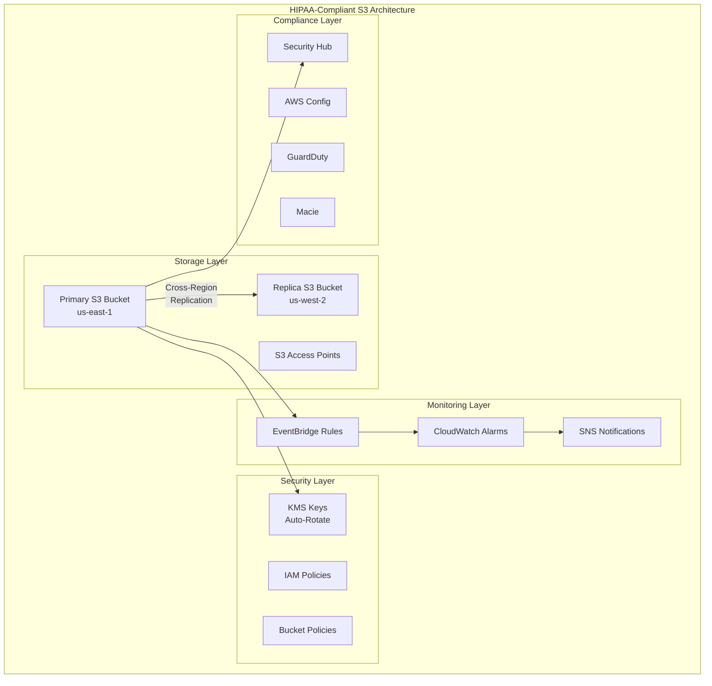

# HIPAA-Compliant S3 Bucket Terraform Module

[](https://github.com/phin3has/PHI-s3-bucket/actions/workflows/terraform-ci.yml)
[](https://github.com/phin3has/PHI-s3-bucket/actions/workflows/security-scan.yml)
[](https://github.com/phin3has/repo/blob/main/SECURITY.md)
[](https://github.com/hashicorp/terraform)
[](https://registry.terraform.io/providers/hashicorp/aws/latest)
[](https://opensource.org/licenses/MIT)

# HIPAA-Compliant S3 Bucket Terraform Module

A production-ready Terraform module for deploying HIPAA-compliant S3 buckets with enterprise-grade security features for storing Protected Health Information (PHI).

## 📚 Table of Contents

- [Quick Start](#quick-start)
- [Features](#features)
- [Architecture](#architecture)
- [Security & Compliance](#security--compliance)
- [Usage Examples](#usage-examples)
- [Cost Optimization](#cost-optimization)
- [Monitoring](#monitoring)
- [Contributing](#contributing)

## Overview

## 🏥 Executive Summary

A production-ready Terraform module that provisions HIPAA-compliant S3 infrastructure with enterprise-grade security controls, automated compliance monitoring, and disaster recovery capabilities. Designed specifically for healthcare organizations storing Protected Health Information (PHI).

**Key Benefits:**
- 🔒 **Security First**: Defense-in-depth with encryption, access controls, and monitoring
- ✅ **HIPAA Compliant**: Implements all required technical safeguards
- 🌍 **High Availability**: Multi-region replication with <15min RPO
- 💰 **Cost Optimized**: Intelligent tiering reduces storage costs by up to 70%
- 🚀 **Production Ready**: Battle-tested with comprehensive testing and documentation

## Architecture


## 🚀 Quick Start

### Prerequisites
- Terraform >= 1.5.0
- AWS Account with appropriate permissions
- AWS CLI configured

### Basic Deployment

```hcl
module "phi_bucket" {
  source = "github.com/yourusername/terraform-aws-hipaa-s3"
  
  bucket_name        = "my-phi-data"
  environment        = "prod"
  notification_email = "security@company.com"
}

output "bucket_id" {
  value = module.phi_bucket.bucket_id
}
```

## 🌟 Why This Module?

| Feature | This Module | Typical S3 Modules |
|---------|------------|-------------------|
| **Multi-Region HA** | ✅ Automated cross-region replication | ❌ Single region |
| **Compliance** | ✅ HIPAA, SOC2, PCI ready | ⚠️ Basic security |
| **Access Control** | ✅ S3 Access Points + VPC isolation | ❌ IAM only |
| **Cost Management** | ✅ Intelligent tiering + lifecycle | ❌ Manual management |
| **Security Monitoring** | ✅ Real-time with auto-remediation | ⚠️ Basic logging |
| **PHI Detection** | ✅ Amazon Macie integration | ❌ None |


## Module Structure

```
modules/
├── s3-phi-bucket/          # Core S3 bucket with HIPAA controls
├── monitoring/             # CloudWatch, EventBridge, SNS
└── security-hub/           # Compliance and threat detection

examples/
├── basic/                  # Simple PHI bucket
├── data-lake/             # Analytics-ready configuration  
├── multi-tenant/          # Isolated tenants with access points
└── disaster-recovery/     # Multi-region active-active
```

## Compliance Mapping

### HIPAA Security Rule Compliance

| HIPAA Control | Implementation | Module Component |
|---------------|----------------|------------------|
| §164.308(a)(1) | Security Management Process | AWS Security Hub, Config Rules |
| §164.308(a)(3) | Workforce Training | Documentation, Access Points |
| §164.308(a)(4) | Access Management | IAM Policies, S3 Access Points |
| §164.308(a)(5) | Security Awareness | CloudWatch Alarms, SNS Alerts |
| §164.308(a)(6) | Security Incident Procedures | EventBridge, CloudTrail |
| §164.308(a)(7) | Contingency Plan | Multi-region Replication |
| §164.310(d)(1) | Device and Media Controls | Lifecycle Policies, Versioning |
| §164.312(a)(1) | Access Control | IAM, Bucket Policies, MFA Delete |
| §164.312(a)(2) | Audit Controls | CloudTrail, Access Logging |
| §164.312(b) | Audit Logs | CloudTrail, S3 Access Logs |
| §164.312(c) | Integrity | Versioning, Object Lock |
| §164.312(e) | Transmission Security | SSL/TLS Enforcement |

### AWS Security Standards Compliance

- **AWS Foundational Security Best Practices**: ✓ Enabled
- **HIPAA Security Rule 2003**: ✓ Enabled
- **CIS AWS Foundations Benchmark v1.2.0**: ✓ Enabled

## Architecture Decision Records

### ADR-001: Multi-Region Replication Strategy

**Status**: Accepted

**Context**: PHI data requires high availability and disaster recovery capabilities to meet HIPAA requirements for data availability and contingency planning.

**Decision**: Implement automated cross-region replication to a secondary region with:
- Same-region replication for operational recovery
- Cross-region replication for disaster recovery
- 15-minute RPO target
- Encrypted replication using separate KMS keys

**Consequences**: 
- Increased storage costs (mitigated by lifecycle policies)
- Enhanced data durability and availability
- Compliance with HIPAA contingency planning requirements

### ADR-002: Encryption Strategy

**Status**: Accepted

**Context**: HIPAA requires encryption of PHI at rest and in transit.

**Decision**: Use customer-managed KMS keys with:
- Automatic key rotation enabled
- Separate keys for primary and replica regions
- Bucket key enabled for performance
- SSL/TLS enforced via bucket policy

**Consequences**:
- Full control over encryption keys
- Audit trail of key usage
- Slight performance overhead (mitigated by bucket keys)

### ADR-003: Access Control Model

**Status**: Accepted

**Context**: Different teams and applications need varying levels of access to PHI data.

**Decision**: Implement S3 Access Points for granular access control:
- VPC-restricted access points for internal services
- Separate access points per use case
- Policy-based access control
- No direct bucket access

**Consequences**:
- Simplified permission management
- Better security isolation
- Easier audit and compliance

### ADR-004: Cost Optimization Approach

**Status**: Accepted

**Context**: Healthcare data grows continuously, requiring cost management strategies.

**Decision**: Implement automated cost optimization:
- Intelligent-Tiering for automatic storage class transitions
- Lifecycle policies for predictable access patterns
- Archive to Glacier after 90 days
- Delete non-current versions after 2 years

**Consequences**:
- Reduced storage costs (up to 70% for archived data)
- Automated management reduces operational overhead
- Maintains compliance while optimizing costs

### ADR-005: Security Monitoring Strategy

**Status**: Accepted

**Context**: HIPAA requires monitoring and alerting for security incidents.

**Decision**: Implement comprehensive monitoring stack:
- EventBridge for real-time event processing
- Security Hub for centralized findings
- GuardDuty for threat detection
- Macie for data classification

**Consequences**:
- Proactive security incident detection
- Automated compliance checking
- Centralized security visibility

## Security Features

### Defense in Depth

1. **Network Layer**
   - VPC-restricted S3 Access Points
   - Private endpoint access only

2. **Identity Layer**
   - IAM role-based access
   - MFA enforcement for sensitive operations
   - Principle of least privilege

3. **Application Layer**
   - Bucket policies enforcing encryption
   - SSL/TLS requirement
   - Request authentication

4. **Data Layer**
   - Encryption at rest with KMS
   - Encryption in transit
   - Versioning for data integrity

5. **Monitoring Layer**
   - Real-time security alerts
   - Compliance monitoring
   - Threat detection

### Security Controls

- **Preventive Controls**
  - Public access block
  - Encryption enforcement
  - SSL/TLS requirement
  - MFA delete protection

- **Detective Controls**
  - CloudTrail logging
  - S3 access logging
  - EventBridge monitoring
  - Security Hub findings

- **Responsive Controls**
  - Automated alerting
  - Incident response procedures
  - Security team notifications

## Cost Optimization

### Storage Class Optimization

The module implements intelligent storage management:

1. **Standard Storage** (0-90 days)
   - For frequently accessed PHI data
   - Immediate access

2. **Standard-IA** (Replication target)
   - For disaster recovery copies
   - Reduced storage cost

3. **Intelligent-Tiering** (Enabled by default)
   - Automatic optimization based on access patterns
   - No retrieval fees

4. **Glacier** (90+ days)
   - For long-term compliance archives
   - 90% cost reduction

### Cost Monitoring

- S3 Storage Analytics for usage patterns
- Cost allocation tags for chargeback
- CloudWatch metrics for storage optimization

## Monitoring and Alerting

### Real-time Security Events

The module monitors and alerts on:

- Unauthorized access attempts
- Object deletion attempts
- Bucket policy changes
- Encryption configuration changes
- Public access configuration changes
- Large file uploads (potential data exfiltration)

### CloudWatch Dashboard

Comprehensive dashboard showing:
- Bucket size and object count
- Request metrics (GET, PUT, DELETE)
- Error rates (4xx, 5xx)
- Replication metrics
- Access patterns

### Alert Notifications

- SNS email notifications for critical events
- CloudWatch alarms for threshold breaches
- Security Hub findings for compliance issues

## Examples

### Data Lake Configuration

```hcl
module "phi_data_lake" {
  source = "./modules/s3-phi-bucket"

  bucket_name  = "healthcare-data-lake"
  environment  = "prod"
  
  # Data lake specific settings
  enable_intelligent_tiering = true
  transfer_acceleration     = true
  
  # Analytics configuration
  analytics_configuration = {
    id            = "access-patterns"
    output_bucket = "analytics-results"
    output_prefix = "s3-analytics/"
  }
  
  # Inventory for data catalog
  inventory_configuration = {
    id                     = "weekly-inventory"
    output_bucket          = "data-catalog"
    output_prefix          = "inventory/"
    schedule_frequency     = "Weekly"
    included_object_versions = "Current"
  }
}
```

### Backup Archive Configuration

```hcl
module "phi_backup_archive" {
  source = "./modules/s3-phi-bucket"

  bucket_name  = "healthcare-backup-archive"
  environment  = "prod"
  
  # Backup specific settings
  enable_object_lock = true
  object_lock_configuration = {
    mode = "COMPLIANCE"
    days = 2555  # 7 years retention
  }
  
  # Aggressive lifecycle for cost optimization
  lifecycle_rules = [
    {
      id                     = "immediate-archive"
      enabled                = true
      transition_days        = 0
      transition_storage_class = "GLACIER"
    }
  ]
}
```

### Analytics Platform Configuration

```hcl
module "phi_analytics" {
  source = "./modules/s3-phi-bucket"

  bucket_name  = "healthcare-analytics"
  environment  = "prod"
  
  # Analytics workload settings
  request_payer = "Requester"  # Requester pays model
  
  # CORS for web-based analytics tools
  cors_rules = [
    {
      allowed_methods = ["GET", "HEAD"]
      allowed_origins = ["https://analytics.healthcare.com"]
      allowed_headers = ["*"]
      max_age_seconds = 3000
    }
  ]
  
  # Multiple access points for different teams
  access_point_configs = [
    {
      name   = "data-scientists"
      vpc_id = var.analytics_vpc_id
    },
    {
      name   = "bi-tools"
      vpc_id = var.bi_vpc_id
    }
  ]
}
```

## CI/CD Integration

### GitHub Actions Workflow

The module includes GitHub Actions workflows for:

1. **Terraform Validation**
   - Syntax checking
   - Format verification
   - Security scanning with tfsec

2. **Automated Testing**
   - Terraform test framework
   - Compliance validation
   - Cost estimation

3. **Documentation**
   - Auto-generated docs
   - Compliance matrix updates

### Pre-commit Hooks

```yaml
repos:
  - repo: https://github.com/antonbabenko/pre-commit-terraform
    rev: v1.77.0
    hooks:
      - id: terraform_fmt
      - id: terraform_validate
      - id: terraform_tfsec
      - id: terraform_docs
  
  - repo: https://github.com/pre-commit/pre-commit-hooks
    rev: v4.4.0
    hooks:
      - id: end-of-file-fixer
      - id: trailing-whitespace
      - id: detect-private-key
      - id: detect-aws-credentials
```

## Troubleshooting

### Common Issues

1. **Replication Not Working**
   - Verify both regions are enabled in your AWS account
   - Check IAM role has cross-region permissions
   - Ensure versioning is enabled on both buckets

2. **Access Denied Errors**
   - Verify SSL/TLS is used (https://)
   - Check encryption headers are included
   - Validate IAM permissions

3. **High Costs**
   - Review lifecycle policies
   - Check Intelligent-Tiering recommendations
   - Analyze access patterns with S3 Analytics

4. **Compliance Findings**
   - Review Security Hub findings
   - Check Config rule compliance
   - Validate all security features are enabled

### Debug Commands

```bash
# Check bucket encryption
aws s3api get-bucket-encryption --bucket <bucket-name>

# Verify replication status
aws s3api get-bucket-replication --bucket <bucket-name>

# List access points
aws s3control list-access-points --account-id <account-id>

# Check Security Hub findings
aws securityhub get-findings --filters '{"ResourceType": [{"Value": "AwsS3Bucket", "Comparison": "EQUALS"}]}'
```

## Contributing

1. Fork the repository
2. Create a feature branch
3. Commit your changes
4. Push to the branch
5. Create a Pull Request

### Development Guidelines

- Follow Terraform best practices
- Include tests for new features
- Update documentation
- Run pre-commit hooks
- Ensure HIPAA compliance

## License

This module is licensed under the MIT License. See LICENSE file for details.

## Support

For issues and feature requests, please file a GitHub issue.

For security issues, please see SECURITY.md for responsible disclosure process.